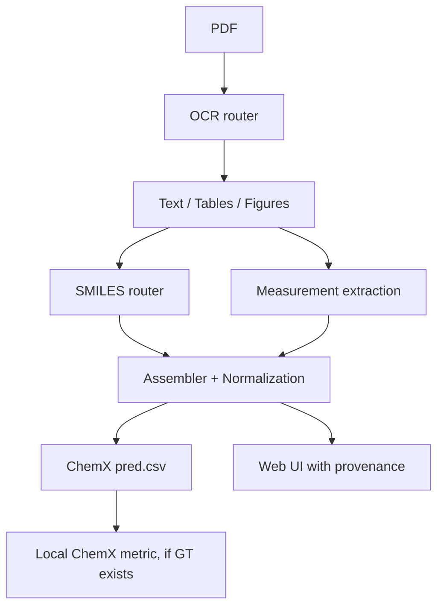

# scinex — мультиагентная система извлечения химических данных

**Система для соревнования DataCon'26 / ChemX.** scinex преобразует научные PDF-статьи в структурированные химические таблицы в схеме ChemX и сохраняет происхождение каждого значения: из какой таблицы, рисунка, страницы или фрагмента текста оно было получено. Для этого система объединяет специализированные модели распознавания, детерминированные химические инструменты и LLM в графе решений, который строится отдельно для каждого документа.

## Кратко

- scinex принимает научный PDF и выбранный ChemX-домен, а на выходе формирует совместимый `pred.csv` и расширенный JSON с provenance по каждой ячейке.
- Лучший проверенный результат: **Benzimidazoles 0.217 → 0.461 Macro-F1**, **Oxazolidinones 0.491 → 0.828 Macro-F1**.
- Главный вклад — не один OCR/LLM-модуль, а маршрутизация документа, сборка строк по схеме домена, нормализация единиц и ключей PDF, связывание данных из текста, таблиц и рисунков.
- Для benchmark PDF система показывает метрики, потому что есть эталон ChemX. Для неизвестных PDF система показывает извлечение, уверенность и provenance, но не Macro-F1: без эталонной таблицы F1 посчитать нельзя.
- Репозиторий содержит backend, single-page web interface, локальную метрику ChemX и команды для воспроизведения ключевых результатов.

---

## 1. Результаты: проверка по метрике ChemX

Метрика реализована в `hw_chemdb/metric_local.py`. Это локальная реализация ChemX `metric_calc`, которая воспроизводит официальный single-agent baseline (**0.2170**). Macro-F1 считается как среднее F1 по полям: каждая колонка сопоставляется **независимо как точное мультимножество значений**; tp/fp/fn агрегируются по статьям внутри каждого поля, после чего F1 усредняется между полями.

### Benzimidazoles — извлечение MIC, 9 open-access статей

| поле | scinex F1 |
|---|---:|
| compound_id | 0.670 |
| smiles | 0.083 |
| target_type | 0.718 |
| target_relation | 0.718 |
| target_value | 0.434 |
| target_units | 0.487 |
| bacteria | 0.118 |
| **Macro-F1** | **0.461** |

**Baseline 0.217 → 0.461: +0.244 абсолютных пункта (+112%)**. Оценка рассчитана по всем 9 OA-статьям, а не только по 7 статьям, PDF которых удалось получить.

### Oxazolidinones — сквозной запуск на домене без отдельной настройки, 2 статьи

Полный вывод scinex: строки соединений + IUPAC→OPSIN SMILES. Это **не** ручная правка baseline: домен отдельно не донастраивался.

| поле | baseline | scinex |
|---|---:|---:|
| compound_id | 0.805 | 0.980 |
| smiles | 0.000 | 0.493 |
| target_type | 0.777 | 0.980 |
| target_relation | 0.805 | 0.951 |
| target_value | 0.264 | 0.929 |
| target_units | 0.000 | 0.980 |
| bacteria | 0.782 | 0.480 |
| **Macro-F1** | **0.491** | **0.828** |

**+0.337 абсолютных пункта (+69%)**. Основной прирост связан с чтением табличных измерений и нормализацией единиц, а **не** только с улучшением SMILES.

### Восемь bonus-доменов — post-extraction улучшения без повторного чтения PDF

Использованы предсказания baseline и дополнительные слои нормализации/разрешения scinex: корректные ключи PDF, Unicode-нормализация единиц, name→structure, canonical SMILES.

| domain | baseline | + improvements | главный фактор |
|---|---:|---:|---|
| oxazolidinone | 0.491 | 0.606 | нормализация micro-sign U+00B5→U+03BC |
| cocrystals | 0.296 | 0.480 | name→PubChem SMILES |
| nanozymes | 0.164 | 0.331 | нормализация PDF-ключей |
| seltox | 0.025 | 0.117 | нормализация PDF-ключей |
| cytotoxicity | 0.182 | 0.231 | нормализация PDF-ключей |
| synergy | 0.074 | 0.100 | нормализация PDF-ключей |
| magnetic | 0.019 | 0.037 | нормализация PDF-ключей |
| complexes | 0.218 | 0.230 | name→PubChem |
| **8-domain avg** | **0.184** | **0.266** | |

### Статус оценки по доменам

| домен | режим | чтение PDF | статус метрики |
|---|---|---:|---|
| Benzimidazoles | end-to-end extraction | да | проверено локальной метрикой ChemX |
| Oxazolidinones | end-to-end extraction | да | проверено локальной метрикой ChemX |
| Co-crystals | post-extraction normalization | нет | baseline pred + слои scinex |
| Nanozymes | post-extraction normalization | нет | baseline pred + слои scinex |
| SelTox | post-extraction normalization | нет | baseline pred + слои scinex |
| Cytotoxicity | post-extraction normalization | нет | baseline pred + слои scinex |
| Synergy | post-extraction normalization | нет | baseline pred + слои scinex |
| Magnetic / Nanomag | post-extraction normalization | нет | baseline pred + слои scinex |
| Complexes | post-extraction normalization | нет | baseline pred + слои scinex |

Здесь важно разделять два режима. **End-to-end** означает, что система читает PDF и строит структурированный вывод. **Post-extraction normalization** означает, что уже существующий baseline output улучшается детерминированными слоями: нормализацией ключей PDF, Unicode-единиц, SMILES и названий веществ.

### Что оценивается и что не оценивается

Официальная метрика ChemX оценивает точное совпадение значений в колонках. Она не проверяет качество интерфейса, объяснимость вывода или корректность каждой строки как связанной записи `compound_id + property + value + organism`. Поэтому scinex дополнительно хранит provenance, confidence и статус проверки, хотя эти поля не входят в официальный Macro-F1.

---

## 2. Задача

ChemX требует одну структурированную строку на каждую пару **compound × measurement**. Для антибактериальных доменов это поля: `compound_id, SMILES, target_type, target_relation, target_value, target_units, bacteria`. Задачу усложняют три фактора.

- **Мультимодальное объединение.** Ни один источник не содержит всю строку целиком. **SMILES** может находиться на рисунке как нарисованная химическая структура, **value/units** — в таблице, а **organism** — в тексте. Всё это должно быть связано с одним и тем же compound. Поэтому система читает каждую модальность отдельно и объединяет результаты по идентичности соединения.
- **SAR-серии, а не отдельные структуры.** В medicinal chemistry статьях часто рисуют scaffold + R-group table + series labels (`5a–h`, `2a–2n`). Эталонные `compound_id` — это перечисленные варианты серии, поэтому одного распознавания структуры недостаточно: варианты нужно восстановить из scaffold и R-table.
- **Метрика точного мультимножества.** Каждая колонка оценивается как мультимножество точных строк. Поэтому нормализация критична: несовпадение Greek-µ и micro-sign-µ или точки/подчёркивания в DOI-ключах может обнулить целые статьи. Значительная часть прироста получается за счёт детерминированной очистки данных, а не только за счёт моделей.

### Контракт входа и выхода

**Вход:**

- PDF научной статьи;
- выбранный домен ChemX;
- опционально: benchmark mode, если PDF входит в набор с известной эталонной таблицей.

**Выход:**

- ChemX-compatible `pred.csv` для выбранного домена;
- расширенный JSON с `value`, `raw`, `dtype`, `unit`, `confidence` и `provenance[]` по каждой ячейке;
- локальные метрики, если для PDF есть ChemX GT;
- очередь `needs_review` для неоднозначных или непроверенных значений.

Пример CSV для антибактериального домена:

```csv
pdf,compound_id,smiles,target_type,target_relation,target_value,target_units,bacteria
antibiotics10081002,7,CC1=...,MIC,=,4,µg/mL,S. aureus
```

### Схемы доменов

У разных ChemX-доменов разные наборы колонок, поэтому scinex использует schema registry и экспортирует отдельный `pred.csv` под каждый домен.

| домен | основные поля |
|---|---|
| Benzimidazoles / Oxazolidinones | `compound_id`, `smiles`, `target_type`, `target_relation`, `target_value`, `target_units`, `bacteria` |
| Co-crystals | `name_cocrystal`, `ratio_cocrystal`, `name_drug`, `SMILES_drug`, `name_coformer`, `SMILES_coformer`, `photostability_change` |
| Complexes | `compound_id`, `compound_name`, `SMILES`, `SMILES_type`, `target` |
| Nanozymes | `formula`, `activity`, `syngony`, `length`, `width`, `depth`, `surface`, `km`, `vmax`, `ph`, `temperature` |
| Nanomag / Cytotox / SelTox / Synergy | доменные поля для состава, размеров, покрытия, условий синтеза, биологических объектов и измерений |

---

## 3. Архитектура

Для каждого документа строится **граф решений** (`pipeline_graph.py`), который направляет статью через подходящие инструменты. Каждый узел логирует `{decision, why, evidence}` — принятое решение, причину и подтверждающие данные.

```text
N0 doc_type (pdf|web)
N1 classify   (scanned vs digital; embedded-figure count; vector flag)
N2 ingest     (OCR dispatch: pymupdf | Mathpix | Mistral, confidence-gated)
N3 figures    (vector → raster pages for OCSR)
N4 strategy   (per-paper SMILES strategy: OPSIN | PubChem | OCSR)
N5 run        (execute the chosen strategy)
N6 coref      (structure ↔ compound_id; подключено как заготовка — см. §6)
N7 gates      (confidence + completeness)
```

Общая схема потока данных:



### Stage 0 — загрузка и OCR-маршрутизация

`ocr/dispatch.py` выбирает OCR-движок для каждой статьи с учётом confidence threshold:

- **pymupdf4llm** — PDF с текстовым слоем: быстрый, бесплатный, используется по умолчанию.
- **Mathpix** — статьи с большим количеством формул и таблиц → LaTeX + pipe-tables, confidence по строкам + bbox (`include_line_data`). Также используется как резервный вариант, если confidence Mistral низкий.
- **Mistral OCR** — сканы и PDF без текстового слоя → per-word confidence + figure bboxes; эти bbox также помогают локализовать структуры на Stage 1.
- **GROBID / JATS / HTML** — для open-access XML full text.

Маршрутизация важна для выбора стратегии: OPSIN требует чистые systematic names, поэтому статьи со сканами или большим количеством формул лучше направлять через Mathpix/Mistral, а не через pymupdf.

### Stage 1 — детекция молекул

Используются OpenChemIE **MolDetect** и **decimer-segmentation**. decimer-segmentation рендерит векторные PDF-страницы в raster images и вырезает отдельные молекулярные структуры.

### Stage 2 — OCSR: structure → SMILES

Используется ensemble: full-page batch prompts и RDKit complete-core filter.

| engine | роль |
|---|---|
| **Claude-opus vision** | основной OCSR-движок |
| MolScribe (OpenChemIE) | локальная open-source база |
| DECIMER 2.8 | локальная open-source база, дополняет MolScribe |
| ~~Gemini~~ | исключён: не дал дополнительных правильных значений и снижал precision |

Ключевое наблюдение: на review paper с 57 структурами **Claude-opus прочитал 26**, тогда как MolScribe — 1, DECIMER — 3, Gemini — 2. Ранний вывод о низком «потолке» OCSR оказался артефактом слабых моделей. Однако *fused bis-heterocycles* остаются сложным случаем: Claude справился с 2/4, специализированные OCSR-инструменты — с 0/4. Поэтому система использует full-page JSON prompts примерно по 12 секунд на 3 страницы, не использует per-crop режим из-за высокой стоимости по времени, и всегда фильтрует VLM-вывод через core-filter. Такой фильтр нужен, потому что Gemini однажды сгенерировал 207 структур при 2 правильных совпадениях.

### SMILES strategy router (`smiles_router.py`)

SMILES выбирается по **типу статьи**, а не принудительно через один инструмент. Порядок предпочтения: **OPSIN > PubChem > OCSR**.

- **IUPAC → OPSIN** — когда систематические названия плотно представлены в экспериментальном разделе → `py2opsin`, детерминированно и точно. На oxazolidinone это подняло smiles с 0.000 до 0.493; в одной статье Molecules получилось 17/17 точных совпадений, тогда как MolScribe не прочитал ни одной структуры.
- **name → PubChem** — для тривиальных drug names → PUG REST IsomericSMILES. На cocrystals это подняло SMILES с 0 до 0.637.
- **OCSR ensemble** — для compounds, которые есть только на рисунках и имеют labels вроде `5a`, без названий. Это резервный путь для сложных случаев.
- `union_clean` объединяет и дедуплицирует результаты из всех применимых источников.

### Text tasks

- **DeepSeek-V4-Pro через direct API** — основная модель для текстовых задач: strategy classification, high-volume measurement-row extraction, R-table parsing. На IUPAC extraction показал сопоставимое с Claude-opus качество: 7/7, при значительно меньшей стоимости.
- **Claude-opus** — используется для сложных и критичных случаев: извлечения строк oxazolidinone и IUPAC-названий.

### Assembly + normalization

- `assemble.py` — один domain-general assembler: назначает SMILES по `compound_id` из R-group enrichment / OPSIN / PubChem и применяет domain-aware normalization. Проверка: neutral на benz и **+0.337 на oxazolidinone**, то есть одна функция переносится между доменами.
- `normalize.py` — `norm_number` (comma→point, remove trailing `.0`), `micro_norm` (per-domain Unicode µ: benz U+00B5, oxa/nanozymes U+03BC; глобальное предположение про один вариант µ было ошибкой), safe full-row `dedup_objects`.
- **Три системных приёма с большим эффектом:**
  1. **Нормализация PDF-ключей.** В эталоне имена файлов используют точки DOI (`1.2736303.pdf`), а baseline использовал подчёркивания. Из-за точного строкового сопоставления статья не находится и получает 0. В Nanozymes совпало 0/39 статей. Формирование output по соглашению исходных данных восстанавливает +0.017…+0.167 по доменам.
  2. **Нормализация micro-sign.** В эталоне используется Greek-µ (U+03BC), а в части выводов — micro-sign (U+00B5): +0.115 на oxazolidinone.
  3. **name → structure.** PubChem IsomericSMILES для именованных drugs: cocrystals SMILES 0.000 → 0.637.

### Canonicalization, dedup, conflicts (`hw_chemdb/`)

40-колоночная схема **Record** хранит raw value, standardized value, conversion rule и provenance (`source_type`, `source_page`, `evidence`, `extractor`), а также `value_min/max/op` и `validation` status (`passed | unverified | failed`).

- **Dedup** — 5 уровней: InChIKey → CID → CAS → fuzzy name через RapidFuzz. Дубликаты помечаются, но не удаляются.
- **Conflicts** — один compound + property с расходящимися значениями → metadata `conflict_group`, без silent averaging.
- **Ничего не выдумывается.** Trade names, mentions only by label, value without compound, dummy-capped structure → `needs_review` queue с указанием причины.

---

## 4. Вариант без генеративных LLM (`hw_chemdb`)

Параллельный pipeline строит такой же curated CSV **без chat-LLM**. Используются только domain tools: детерминированные OPSIN, RDKit, pint, PubChem и *обученные* модели распознавания OpenChemIE: MolDetect, MolScribe, RxnScribe, ChemRxnExtractor.

Почему это считается вариантом без генеративных LLM: OpenChemIE — это конвейер узких обученных моделей, включая detector, OCSR и NER-BERT. Он не занимается свободной генерацией текста, а каждый SMILES дополнительно проверяется RDKit. На 8 статьях обученный OpenChemIE **coreference** восстановил 40 числовых molecule↔id связей против 3 у геометрической эвристики “label-under-structure”.

---

## 5. Что даёт преимущество системе

Стратегический вывод: **Claude-vision SMILES сам по себе не является устойчивым преимуществом.** На `acsomega.2c06142` Claude-vision *alone* даёт тот же smiles-F1 0.444, что и OPSIN strategy. Любой участник может вызвать современную VLM. Поэтому преимущество находится не в одной SMILES-колонке, а в инженерии вокруг неё, которая улучшает остальные шесть колонок и переносимость между доменами.

- **Извлечение measurement rows**: 3 из 7 колонок. На oxazolidinone `target_value` 0.264 → 0.929, `target_units` 0.000 → 0.980. Именно это сдвинуло Macro-F1 с 0.49 до 0.83, а не только SMILES.
- **Нормализация**, которую легко пропустить: Unicode units, pdf-key matching, name canonicalization.
- **Дисциплина сборки мультимножества** — контроль количества строк, чтобы precision не падал из-за over-production.
- **Граф решений для каждого документа** — scanned/vector/names/figures, confidence gates, vector→raster.
- **Назначение coreference** — правильный SMILES должен попасть к правильному `compound_id`; VLM часто выдаёт только общий pool структур.
- **Переносимость между доменами** — один assembler: neutral на benz, +0.337 на домене без отдельной настройки.

---

## 6. Честные выводы и ограничения

- **SMILES остаётся самой сложной колонкой**: 0.083 на benz. Fused bis-heterocycles не читаются ни одним OCSR-инструментом и даже современными VLM в части случаев; это реальное ограничение, подтверждённое четырьмя инструментами.
- **coreference не помогает SAR papers**: 1/57 correct. Такие статьи рисуют scaffold + series label + R-table; эталонные ids — это *enumerated variants*. Coreference связывает scaffold↔series-label, но требуется именно enumeration. Это уже делает LLM R-enrichment (`scaffold + R-table → {compound_id: R-fragment}`). Поэтому coreference остаётся отключённой заготовкой; он был бы полезен только в статьях, где каждое соединение полностью нарисовано с индивидуальным label.
- **Pool-cycled SMILES.** Если в статье нет надёжного compound→structure match, SMILES из OCSR pool циклически прикрепляются к строкам. Это помогает *multiset* метрике, где колонки считаются независимо, но per-compound mapping становится ненадёжным. Только 243/701 benz rows self-consistent. В web UI остальные честно помечаются как **“structure unresolved”**, вместо того чтобы показывать неправильную молекулу.
- **Регистр названий бактерий — хрупкость метрики, а не содержательная ошибка.** Эталон использует title-case `S. Aureus Atcc 25923`; научно корректный вариант `S. aureus ATCC 25923` наказывается метрикой точного строкового совпадения. Поэтому oxa bacteria падает с 0.782 до 0.480.
- **Ограничение публичного benchmark.** Эти статьи публичны, поэтому знания VLM нельзя полностью отделить от чтения документа. Это важно для новых статей; для оценки ChemX прирост остаётся реальным.

### Очередь ручной проверки

Система не должна молча заполнять химические данные, если доказательств недостаточно. Такие случаи попадают в `needs_review` с причиной:

- `structure_unresolved` — структура не связана надёжно с compound_id;
- `invalid_smiles` — SMILES не проходит RDKit-проверку;
- `value_without_compound` — найдено значение, но не найден соответствующий compound;
- `compound_without_measurement` — найден compound, но нет измерения в нужной схеме;
- `conflicting_measurements` — разные источники дают разные значения для одного свойства;
- `low_ocr_confidence` — OCR не даёт достаточной уверенности;
- `unit_ambiguous` — единица измерения отсутствует или неоднозначна.

Это делает систему более честной для новых PDF: лучше явно пометить неопределённость, чем показать химически неправильную структуру или измерение.

---

## 7. Web interface

FastAPI backend + single-page app, deployed at `neuro-mri.pro/scinex/`, делают извлечение проверяемым.

- **Endpoint** `POST /api/chemx/extract` возвращает **cell model**: `rows[].cells[field] = {value, raw, dtype, unit, confidence, provenance[]}`. У каждой ячейки есть **provenance**: source modality (`image`/`table`/`text`), document, locator (`figure_label` / `table_cell` / `char_span`) и extractor.
- **Отображение**: реальные RDKit-drawn structures; просмотр provenance по каждому полю: из какого figure/table/page пришло значение; confidence и отметки multi-source consensus; явная карточка **“structure unresolved”**, если SMILES ненадёжен.
- **Гибридный режим**: benchmark PDF возвращает заранее рассчитанное извлечение **с реальными метриками**; неизвестный PDF запускает live extraction (OCR + LLM + OCSR) и возвращает те же расширенные строки, но **без метрик**. Основной продукт — само извлечение; слой Macro-F1 доступен только для benchmark-документов.
- **Эксплуатация**: `systemd` service (`Restart=always`, boot-start`) за nginx на существующем TLS host; публичный маршрут без авторизации.

### Benchmark mode и live mode

| режим | что происходит | метрики |
|---|---|---|
| Benchmark PDF | возвращается заранее рассчитанное или воспроизводимое извлечение для PDF из ChemX-набора | Macro-F1 доступен, если есть GT |
| Unknown PDF | запускается live extraction: OCR + LLM + OCSR + сборка строк | Macro-F1 не показывается, потому что нет GT |

Это разделение важно для корректной демонстрации: scinex можно применять к новым статьям, но F1 — это свойство benchmark-сравнения с эталоном, а не свойство самого PDF.

---

## 8. Стек технологий

- **OCSR**: OpenChemIE (MolDetect / MolScribe / RxnScribe), DECIMER 2.8, decimer-segmentation; Claude-opus vision.
- **Deterministic chemistry**: RDKit для canonical SMILES и InChIKey; OPSIN для IUPAC→structure через `py2opsin`; PubChem PUG REST; pint для units.
- **OCR**: pymupdf4llm, Mathpix с LaTeX + tables + line-confidence + bbox, Mistral OCR; GROBID / JATS.
- **LLMs**: DeepSeek-V4-Pro через direct API как основная текстовая модель; Claude-opus для сложного извлечения и primary vision OCSR; Gemini был протестирован и исключён.
- **Backend**: FastAPI, uvicorn, pandas, RDKit; более широкий scinex engine использует PostgreSQL + pgvector. Web: self-contained SPA с отображением RDKit SVG.

---

## 9. Репозиторий и воспроизведение

### Quick start

```bash
git clone <repo-url>
cd scinex

python -m venv .venv
source .venv/bin/activate  # Windows: .venv\Scripts\activate
pip install -r requirements.txt

cp .env.example .env
# заполните API-ключи только если нужен live OCR/LLM extraction

uvicorn web.app:app --host 0.0.0.0 --port 8000
```

После запуска web-интерфейс доступен по адресу:

```text
http://localhost:8000
```

### Environment variables

Пример `.env.example`:

```env
ANTHROPIC_API_KEY=
DEEPSEEK_API_KEY=
MATHPIX_APP_ID=
MATHPIX_APP_KEY=
MISTRAL_API_KEY=
PUBCHEM_EMAIL=
```

В репозиторий не должны попадать реальные API-ключи, `.env`, скачанные PDF, временные OCR-файлы, кэши, приватные результаты и крупные model weights.

### Структура репозитория

```text
chemx/
  assemble.py            общий assembler для доменов (SMILES по id + normalization)
  smiles_router.py       маршрутизатор стратегии (OPSIN | PubChem | OCSR ensemble)
  scripts/               extractors, scorers, normalize.py
  results/               извлечения по статьям, chem_db.dedup.csv, benz_pred_final.csv
  data/gold/             эталонные CSV ChemX (Benzimidazoles, Oxazolidinones)
hw_chemdb/
  record.py              40-колоночная схема Record (raw + std + provenance + validation)
  dedup.py conflicts.py resolve.py standardize.py
  metric_local.py        локальная метрика ChemX (точно воспроизводит baseline 0.2170)
ocr/
  dispatch.py            OCR-маршрутизатор с confidence gate
  mistral_ocr.py mathpix.py openchemie_worker.py molscribe_worker.py decimer_worker.py
web/
  app.py                 FastAPI backend (cell-model + RDKit SVG)
  scinex_front.html      single-page interface
```

### Воспроизведение ключевых показателей

```bash
# Benzimidazoles — 0.461 по 9 OA-статьям
python chemx/scripts/build_benz_pred.py
python hw_chemdb/metric_local.py --dataset benzimidazole --source single_agent \
       --pred chemx/results/benz_pred_final.csv

# Oxazolidinones — 0.828 end-to-end
python chemx/scripts/oxa_score.py
```

`metric_local.py` точно воспроизводит официальный single-agent baseline (**0.2170**) — это контрольная точка для всех чисел выше.

### Рекомендуемые дополнительные файлы

Для удобства проверки репозиторий желательно держать в таком виде:

```text
README.md
README_RU.md
.env.example
requirements.txt
.gitignore
docs/
  metric.md
  schemas.md
  architecture.md
  reproduction.md
  limitations.md
scripts/
  download_chemx_pdfs.py
  reproduce_benz.sh
  reproduce_oxa.sh
web/
  app.py
  scinex_front.html
```

### Минимальный checklist перед сдачей

- [ ] `README.md` объясняет, какие домены поддержаны end-to-end, а какие только через post-extraction normalization.
- [ ] Есть команда запуска backend и web-интерфейса.
- [ ] Есть команда воспроизведения метрик.
- [ ] Есть пример `pred.csv` в ChemX-compatible формате.
- [ ] Есть `.env.example`, но нет настоящего `.env`.
- [ ] В репозиторий не добавлены приватные PDF и API-ключи.
- [ ] Для неизвестных PDF интерфейс не показывает Macro-F1 без GT, а показывает extraction, confidence и provenance.

---

## Установка

Быстрый старт — core + опциональные локальные OCSR-движки (каждый в своём venv) + проброс `*_PYTHON` + воспроизведение метрики: см. **[SETUP.md](SETUP.md)**.
